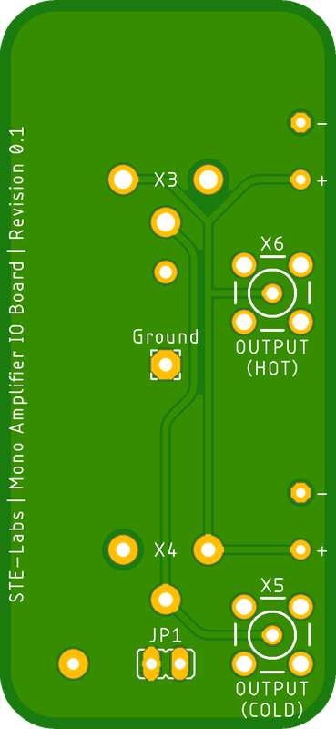
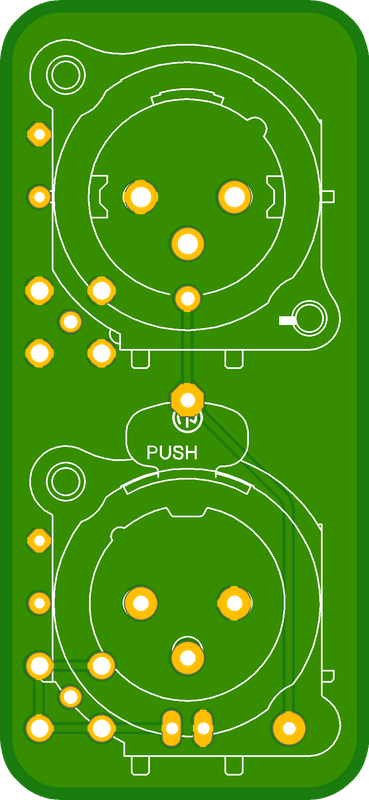
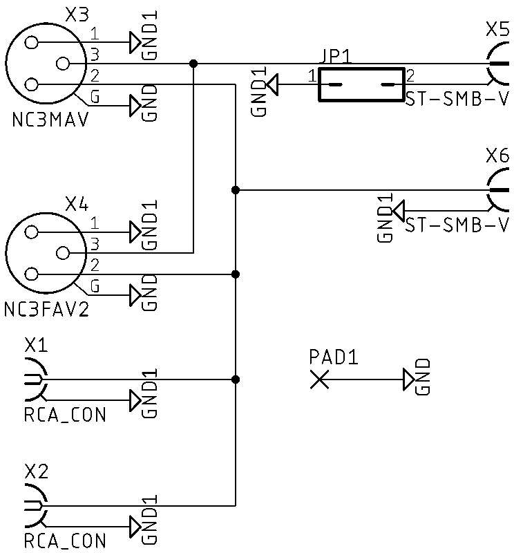

# 3.1 Channel IO Board for RCA
[Home](../README.md)

3 input and 1 output RCA board for routing audio signals

## Table of contents
- [Overview](#overview)
- [PCB Specifications](#pcb-specifications)
- [Circuit Diagram](#circuit-diagram)
- [BOM](#bom)

## Overview

- Designed for 5V DC operation
- 1 input RCA connection
- 1 input XLR connection
- 1 output RCA connection
- 1 output XLR connection
- Minimize wire length for small signals
- Maximize signal to noise ratio
- RFI/EMI shield integrated into the PCB
- Through-hole connections for easy assembly and maintenance

## PCB Specifications
- Size: 115mm x 65mm
- Thickness: 2.0mm
- Material: FR4 S1000H TG150
- Layers: 4
- Finish: Immersion Gold (ENIG)
- Copper weight: 1oz
- Solder mask: Matte black
- Silkscreen: White

## Circuit Diagram

## BOM
|Type|Quantity|Value|Description|
|----|--------|-----|-----------|
|CONNECTOR|2|RCA Black|Signal connectors|
|CONNECTOR|1|XLR IN|Signal connectors|
|CONNECTOR|1|XLR OUT|Signal connectors|
|CONNECTOR|2|SMA|Signal connectors|
|JUMPER|1|2 Pin|Ground Cold Output|
