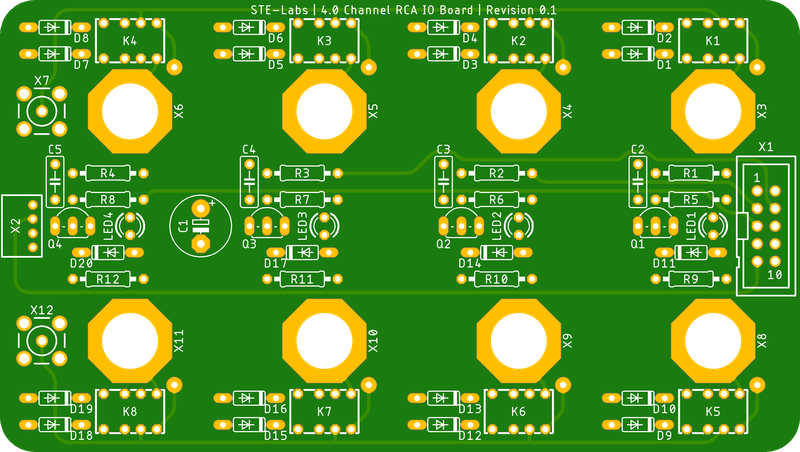
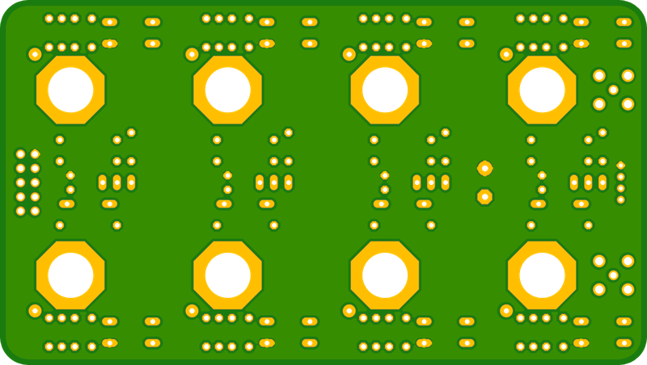

# 4.0 Channel IO Board for RCA
[Home](../README.md)

4 input and 0 output RCA board for routing audio signals

## Table of contents
- [Overview](#overview)
- [PCB Specifications](#pcb-specifications)
- [BOM](#bom)

## Overview

- Designed for 5V DC operation
- 4 input RCA connections with indicator LEDs
- Both signal and ground are switched on RCA boards to prevent ground loops between digital devices
- Minimize wire length for small signals
- Maximize signal to noise ratio
- RFI/EMI shield integrated into the PCB
- Through-hole connections for easy assembly and maintenance

## PCB Specifications
- Size: 115mm x 65mm
- Thickness: 2.0mm
- Material: FR4 S1000H TG150
- Layers: 4
- Finish: Immersion Gold (ENIG)
- Copper weight: 1oz
- Solder mask: Matte black
- Silkscreen: White

## PCB Dimensions

## BOM
|Type|Quantity|Value|Description|
|----|--------|-----|-----------|
|Resistor|4|100Ω|Current limiting resistors|
|Resistor|4|1kΩ|Gate-stop resistors|
|Resistor|4|10kΩ|Pull-down resistors|
|LED|4|3mm|Indicator LEDs|
|MOSFET|4|BS170|Signal switching|
|RELAY|8|OMRON G6D-2|Signal switching|
|DIODE|8|1N4148|Flyback diodes|
|ZENER|8|BZX55C15|Protection diodes|
|CONNECTOR|4|RCA White|Signal connectors|
|CONNECTOR|4|RCA Red|Signal connectors|
|CONNECTOR|2|SMA|Signal connectors|
|CONNECTOR|1|JST PH 4-PIN|Control connectors|
|CONNECTOR|1|2x5 header|Control connectors|
