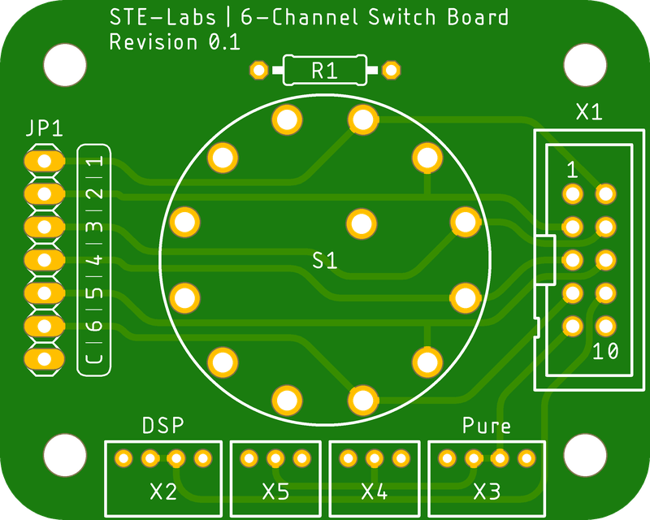
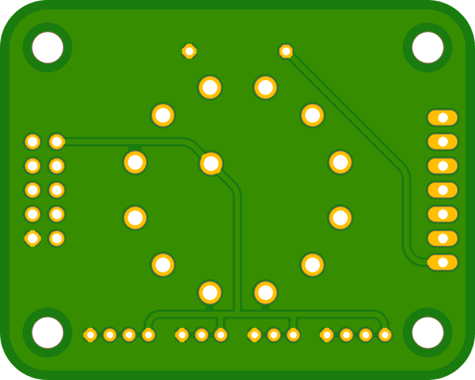

# Analog IO Control Board
[Home](../README.md)

This kit provides a solution for an analog switch control board to control the functions of an amplifier.

## Table of Contents
- [PCB Specifications](#pcb-specifications)
- [Features](#features)
- [Pinout Diagram](#pinout-diagram)

## Overview

- Designed for 5V DC operation
- Analog rotary switch control
- Universal control for multiple io-boards
- LED outputs for status indication with common ground
- Connectors for PURE and DSP modes
- Single Ribbon Cable Connection with the io-boards.

## PCB Specifications
- Size: 50mm x 40mm
- Thickness: 2.0mm
- Material: FR4 S1000H TG150
- Layers: 2
- Finish: Immersion Gold (ENIG)
- Copper weight: 1oz
- Solder mask: Matte black
- Silkscreen: White

|Connector|# Pins|Description|
|---|---|---|
|X1|10|IO-Board connector|
|X2|4|DSP Button connector|
|X3|4|Pure Button connector|
|X4|3|Pure amplifier connector|
|X5|3|Pure amplifier connector|
|JP1|7|LED indicator connector|

## Pinout Diagram

### Single Ribbon Cable Connection
The single ribbon cable connection allows the control board to communicate with the io-boards. The cable connects to the io-boards and provides power and communication to the control board.

| Pin | Function |
|-----|----------|
| 1   | VCC (+5V) |
| 2   | CHANNEL 1|
| 3   | CHANNEL 2|
| 4   | CHANNEL 3|
| 5   | CHANNEL 4|
| 6   | CHANNEL 5|
| 7   | CHANNEL 6|
| 8   | DSP    |
| 9   | PURE   |
| 10  | GND    |

### Pure Mode Connection
The Pure Mode Connection connects the Pure Mode signal from the Control Board with the amplifier board(s). Pure Mode switches the cathode degeneration resistor in the input stage of the amplifier to reduce its gain and increase its linearity.

| Pin | Function |
|-----|----------|
| 1   | VCC (+5V) |
| 2   | SIGNAL|
| 3   | GND|

### Pure Mode Switch Connection
The Pure Mode Switch Connection connects the Pure Mode Switch from the front panel to the the Control Board. Pure Mode switches the cathode degeneration resistor in the input stage of the amplifier to reduce its gain and increase its linearity. The switching signal is also passed onto the Standby Power Supply via the io-board to control the Pure Setting on external amplifiers via the remote control option.

| Pin | Function |
|-----|----------|
| 1   | VCC (+5V) |
| 2   | SWITCH|
| 3   | LED +|
| 4   | LED -|

### DSP Mode Switch Connection
The DSP Mode Switch Connection connects the DSP Mode Switch from the front panel to the Control Board. DSP Mode signals the io-board to route the input signal via an external DSP processor connected on the last channel (commonly Channel 6).

| Pin | Function |
|-----|----------|
| 1   | VCC (+5V) |
| 2   | SWITCH|
| 3   | LED +|
| 4   | LED -|

### LED Connection
The LED Connection connects the optional LEDs from the front panel to the Control Board. The LEDs are used to indicate the active input channel.

The LEDs share a common ground connection via a series resistor to drop the voltage.

| Pin | Function |
|-----|----------|
| 1   | LED1 +|
| 2   | LED2 +|
| 3   | LED3 +|
| 4   | LED4 +|
| 5   | LED5 +|
| 6   | LED6 +|
| 7   | COMMON -|
